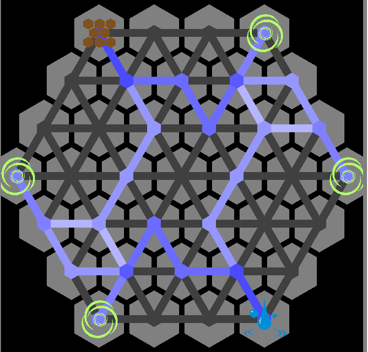

## 战斗职业
### 骑士
没有特点，但是能使用其他职业的武器装备
### 狂战士
高速回血，低护甲，武器主要使用斧头，擅长破防
### 重盾
高护甲，技能主要用于吸引仇恨和范围伤害，武器主要使用斧头和锤子
### 射手
使用特殊的弓和特殊的箭，通过组合弓和箭的效果来随机应变
### 刺客
擅长隐藏气息（消除仇恨），造成单次大量单体伤害
## 法术职业
### 法师
通过咏唱消耗法力来使用法术，无法术种类上限。理论上限是5^3=125个
### 咒术师
预先准备能瞬发的法术符文，使用会积累咒术负载。
符文需要预先放置在符文栏（工具栏的前几格）激活30秒，放在其他地方的符文会需要重新激活。
符文栏的数量取决于咒术负载，最高9格。符文堆叠数量取决于种类。
### 奥术师
在奥术武器（剑/斧）上附着奥术，通过左键/右键释放，通过造成伤害在武器上积累奥术能量。
需要奥术能量才能使用的奥术只能消耗当前这把武器上的奥术能量。

## 人物能力点
1. 体力（生命+护甲）
2. 力量（攻击+暴击伤害）
3. 敏捷（移动速度+攻击速度）
4. 法力
5. 咒术负载
6. 奥术精通

## 古遗物属性类型
生命，护甲，韧性，攻击加，攻击乘，攻击距离，攻击速度，移动速度，暴击率，暴击伤害

## 魔法机制
魔法需要先研究才能使用。法术研究的过程就是完成一张法术图，通过魔力回路连接元素节点。

魔法一共有5种：炼金魔法，炼药魔法，附魔魔法，法术魔法，奥术魔法。
### 魔法研究
魔力会在一个六边形的网格内流动，遵循偏移最小的方向前进。
遇到死路会回头。魔力之间不会互相干涉。
如果遇到偏移相同的2个方向则会一分为二。
如果一个元素节点的魔力需要流向多个元素，则魔力量必须等分（所以1/3比1/4更难实现）。
使用的魔力回路节点数量决定了魔法图的复杂度。

如上图所示：右下角的水元素的魔力会先向上，然后在第三行右数第二个节点分成2股，流入2个风元素。
这两个风元素的魔力会在第二行右数第二个节点汇聚然后流入地元素。 这个魔法图是对称的，所以是水->2风->地->2风->水的循环。

这个构图运用了一些巧妙的结构来保证进入元素的魔力和离开元素的魔力走不同的路。

### 使用
手握法杖跳舞来进行咏唱（上下左右跳分别对应一种元素），集齐4个元素后右键确认绑定，再次右键释放。

法术魔法的效果是不变的，但是魔法图复杂度越高，消耗的魔力/造成的咒术负载越高。
绑定了法术的法杖可以转移到空的符文上，以供咒术师使用。

附魔魔法和炼药魔法通过用绑定了魔法的法杖右键注魔仪式台来进行。
产物等级取决于复杂度，复杂度越低，产物等级越高。
